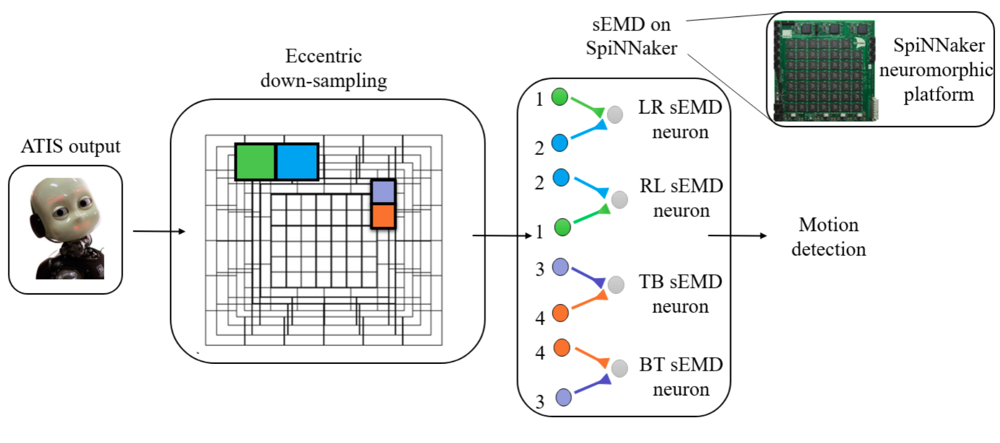

# sEMD-iCub

This is a Spiking Elementary Motion Detector for [iCub](http://www.icub.org/), the humanoid robot.  
The model is able to detect moving objects within the visual field exploiting a non-uniform downsampling of the field of vision.
This model asynchronously processes events from event-driven bio-ispired cameras mounted on iCub.   
Furthermore, the model is hosted on [SpiNNaker](https://ieeexplore.ieee.org/abstract/document/6750072) neuromorphic hardware.

The folder contains:

* [Code](Code): Have a lok at the [README.md](Code/README.md) to learn about the code.
* [Data](Data): Have a lok at the [README.md](Data/README.md) to generate the stimuli we used. This folder also contains the raw data of the real-world experiments.

## Overview of the system

 

## Stimuli: 

### Four cardinal directions 

     

 

### Four transversal directions 

   
  
        